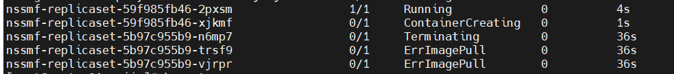
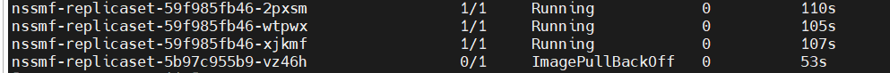
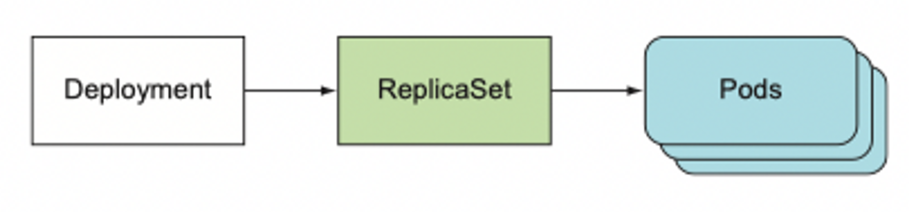
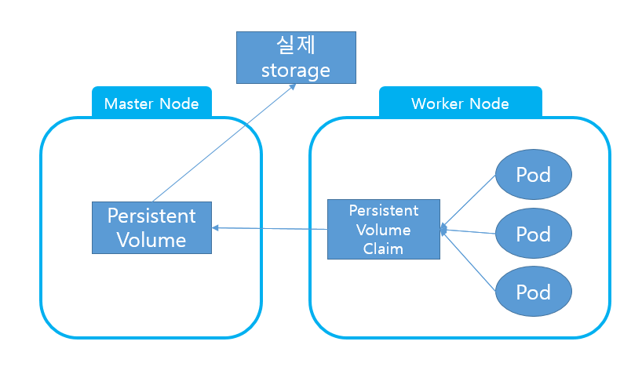

# 워크로드 리소스

## 1. 디플로이먼트(deployment)

파드의 업데이트를 관리하는 오브젝트. 파드의 개수를 관리하는 기능은 없고, 롤링 업데이트를 제공하기 위한 오브젝트이다.

아래는 디플로이먼트의 업데이트 과정이 진행되는 모습이다. 하나의 파드가 업데이트를 완료하고 Running되어야 다른 하나를 Terminating 상태로 돌린다.



아래는 존재하지 않는 이미지로 업데이트를 시도했을 때, 디플로이먼트의 동작 방식이다. 레플리카셋으로 생성한 3개의 파드를 롤링 업데이트하기 위해 새로운 파드를 생성하고 업데이트를 하려 했으나 업데이트 과정에서 에러가 발생해 이전 버전 파드 3개가 모두 돌아가고 있다.


deployment 생성하기(manifest 파일 예시, manifest는 실행할 앱 유형과 시스템을 실행하는 JSON 또는 YAMl 파일): <https://kubernetes.io/ko/docs/concepts/workloads/controllers/deployment/>  
```
apiVersion: apps/v1
kind: Deployment
metadata:
  name: nginx-deployment
  labels:
    app: nginx
spec:
  replicas: 3 # 이 항목을 안 써주면 디폴트로 1 들어감
  selector:
    matchLabels:
      app: nginx
  template:
    metadata:
      labels:
        app: nginx
    spec:
      containers:
      - name: nginx
        image: nginx:1.14.2
        ports:
        - containerPort: 80

```

## 2. 레플리카셋(replicaset)

파드의 개수를 관리하는 오브젝트. 파드의 개수를 일정하게 유지해 사용자가 특정 파드를 삭제하면 자동으로 새로운 파드를 생성한다. 그러나 업데이트 관련 기능은 없기에 업데이트 할 항목이 생겨도 이를 반영하지 못한다.
그래서 없는 이미지를 끌어다가 업데이트 해달라고 해도 아무런 에러를 뱉지 않는다!

replicaset 생성하기: <https://kubernetes.io/ko/docs/concepts/workloads/controllers/replicaset/>  
```
apiVersion: apps/v1
kind: ReplicaSet
metadata:
  name: frontend
  labels:
    app: guestbook
    tier: frontend
spec:
  # 케이스에 따라 레플리카를 수정한다.
  replicas: 3
  selector:
    matchLabels:
      tier: frontend
  template:
    metadata:
      labels:
        tier: frontend
    spec:
      containers:
      - name: php-redis
        image: gcr.io/google_samples/gb-frontend:v3

```

> Deployment VS ReplicaSet  
> Deployment가 ReplicaSet을 포함하는 관계를 갖는다. 둘이 하는 역할은 서로 구분되지만 Deployment가 배포되면 pod와 replicaset이 함께 배포된다. 그러나 replicaset으로 배포하면 pod만 함께 배포된다.  
> 


## 3. 잡
잡은 하나 이상의 파드를 실행하고 해당 파드가 성공적으로 종료되었는지를 추적.  
파드가 비정상적으로 종료되면 재실행하여 일정 개수 이상의 성공적인 파드 동작을 보장.  
잡을 일시 중지하면 running 상태의 모든 파드를 삭제  
ex) 하나의 파드를 실행시키고 종료되는 잡 만들기
```
apiVersion: batch/v1
kind: Job
metadata:
  name: pi
spec:
  template:
    spec:
      containers:
      - name: pi
        image: perl:5.34.0
        command: ["perl", "-Mbignum=bpi", "-wle", "print bpi(2000)"]
      restartPolicy: Never
  backoffLimit: 4
```
> restartPolicy: 파드 내의 컨테이너 재시작 정책  
> 잡의 경우 Never로 restartPolicy가 설정되면 container가 비정상 종료 시, Pod 자체를 재시작 함

## 4. 크론잡
크론잡은 일정 주기로 잡을 계속 생성.  


# 스토리지

## 1. 볼륨

기본적으로 디렉토리이며 파드 내 컨테이너에서 볼륨으로 접근할 수 있다.  

파드 내 컨테이너의 디렉토리가 볼륨과 마운팅 된다는 것은 서로 따로 존재해 동기화된다는 개념이 아니라 볼륨이라는 디랙토리가 존재하고 이를 파드 내 컨테이너의 디렉토리가 바라보는 형태다. 즉, 처음부터 하나의 디렉토리로 동작하는 방식이다.

- emptyDir  
  파드 내부 컨테이너들이 디렉토리를 공유하거나 컨테이너 1이 생성한 파일을 컨테이너 1이 없어진 다음 컨테이너 2가 이어서 사용할 수 있도록 할 때 유용  
  파드의 life cycle에 맞춰 생성 및 삭제 된다.  
  ex) 하나의 Pod에서 nginx와 redis 컨테이너를 만들고 두 컨테이너의 /data/shared를 볼륨에 연결하는 설정  
  ```
  apiVersion: v1
  kind: Pod
  metadata:
    name: shared-volumes
  spec:
    containers:
    - name: redis
      image: redis
      volumeMounts:
      - name: shared-storage
        mountPath: /data/shared
    - name: nginx
      image: nginx
      volumeMounts:
      - name: shared-storage
        mountPath: /data/shared
    volumes:
    - name: shared-storage
      emptyDir: {}
  ```

- hostPath
  hostPath는 노드의 파일 시스템에 볼륨을 생성. 여러 파드에서 마운트(바라보게) 가능  
  life cycle이 파드 기준이 아니라 노드 기준이므로 파드가 종료되어도 남아있어 다음 파드가 해당 데이터에 접근할 수 있다.  
  **보안** 상에 많은 **위험**이 있어서 사용 자제하는 것이 좋다
  ex) 노드의 /tmp 디렉토리를 hostPath를 이용해 파드의 /data/shared 디렉토리에 마운트
  ```
  apiVersion: v1
  kind: Pod
  metadata:
    name: hostpath
  spec:
    containers:
    - name: redis
      image: redis
      volumeMounts:
      - name: terrypath
        mountPath: /data/shared
    volumes:
    - name: terrypath
      hostPath:
        path: /tmp
        type: Directory
  ```


## 2. Persistent Volumes(PV)

PV는 관리자(admin)가 직접 또는 스토리지 클래스를 이용해 동적으로 프로비저닝한 스토리지를 말한다.  

* 프로비저닝: IT 인프라를 설정하는 프로세스. 배포의 초기 단계로 configuration management(구성 관리)와는 다른 개념  

파일 등을 저장하는 storage 관리는 CPU, RAM 등 리소스를 관리와 별개의 문제다. PV는 storage 관리를 위한 개념이다. 퍼시스턴트 볼륨은 volume plugin이지만 PV를 사용하는 개별 파드와 다른 라이프 싸이클을 갖는다.  

PV의 스토리지는 master node에 위치하고 각 worker node는 PVC(Persistent Volume Claim)를 통해 PV를 요청해 스토리지를 사용한다.  

**프로비저닝 방식**  
프로비저닝 방식은 static과 dynamic이 있음  

(1) 정적 프로비저닝: 여러 PV를 만들고 클러스터 사용자에게 사용 가능한 stroage 세부 사항을 제공.
(2) 동적 프로비저닝: administrator가 만든 정적 PV 중에 어떤 것도 사용자가 PVC로 요청한 storage를 충족하지 못한다면 동적으로 클러스터에서 storage를 할당. storage class를 기반으로 동작하기 때문에 API server에 admission controller가 동작할 수 있도록 설정해야 한다.  

- storage class: 동적으로  PV를 생성하는 클래스. 구성 요소로 volumeBindingMode(볼륨이 PVC와 바운딩 되는 정책), provisioner(PV를 생성할 스토리지 종류, ex.aws-ebs), parameters가 있음.  
Q. 스토리지의 개념이 무엇인가? 파일 저장하는 방식에 종류가 있나?  
Q2. PVC가 PV와 일치된다의 개념이 무엇인가?  

**Binding**  
컨트롤 루프가 모든 PVC를 감시하다가 이를 충족하는 PV를 찾아 연결하는 것.  

**Using: 스토리지 사용하기**  
Pod 생성 시 volume 블록에 persistentVolumeClaim을 포함시킨다.

정리하면 아래 그림과 같다.  



> 10개의 파드가 존재하고 각 파드에서 매일 발생하는 데이터를 자정에 삭제하는 잡이 있다고 하자. 이 잡을 파드 내에서 구현하지 않고 외부에서 파드의 데이터를 삭제하는 분리된 크론잡을 만들려고 한다. 쿠버네티스의 어떤 요소를 가지고 어떻게 구현할 수 있을까?  

방법 1. 10개의 파드 특정 디렉토리(/data/oneday와 같이)를 hostPath 볼륨을 이용해 노드 내 일정 디렉토리(/tmp)에 주기적으로 삭제할 데이터를 모아봅니다. 그리고 이를 지우는 클론잡을 만들어서 일정 주기(하루)로 볼륨의 데이터를 삭제하게 합니다.
```
apiVersion: apps/v1
kind: ReplicaSet
metadata:
  name: nssmf
  labels:
    app: nssmf
spec:
  replicas: 10
  selector:
    matchLabels:
      app: nssmf
  template:
    metadata:
      labels:
        app: nssmf
    spec:
      containers:
      - name: nssmf-pod
        image: nssmf_foo:v3
        volumeMounts:
        - name: logpath
          mountPath: /data/log
      volumes:
      - name: logpath
        hostPath:
          path: /log
          type: Directory
```

->  이 방식은 보안 상 문제가 있다. hostPath는 노드의 디렉토리를 직접 사용하므로 보안의 문제가 있고, 파드에서 readOnly로만 볼륨을 사용하는 것이 좋다.

방법2. persistence volume 사용하기  
persistence volume은 파드를 관리하는 노드와 분리된 원격의 저장장치를 마운트하기 때문에 보안 상 문제가 적은가봐용