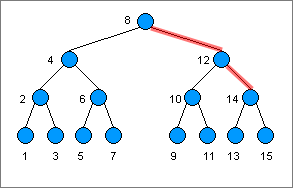

# MongoDB Index 설정하기
index는 MongoDB에 있는 특정 document를 효율적으로 찾을 수 있게 해준다. index가 없으면 모든 document를 탐색하는 단순탐색을 진행할 것이지만 index를 기준으로 정렬해두면(binary tree를 만들면) 빠르게 데이터를 가져다 쓸 수 있다.

## index의 종류
- 기본 인덱스 _id  
    모든 MongoDB의 collection은 _id 필드를 가짐.  
    이는 document의 uniqueness를 보장하고, MongoDB가 중복된 데이터를 저장하지 않도록 한다.

## indexing으로 정보 찾아내는 예시
